# Hide.alfredworkflow
Hide or Unhide Files or Folders in macOS with Alfred Workflow

将单个或多个文件或文件夹设置为显示或隐藏状态，效果相当于文件名前加. ,但不用加. = =
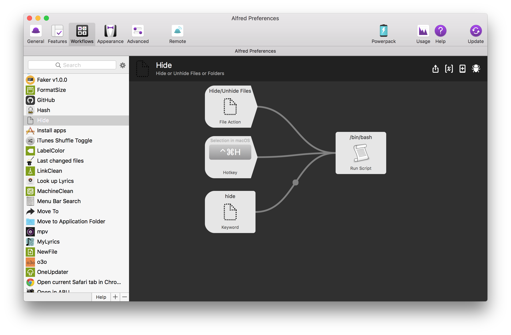

#Toggle input method.alfredworkflow
Set shortcut for each IM

为每个输入法自定义快捷键
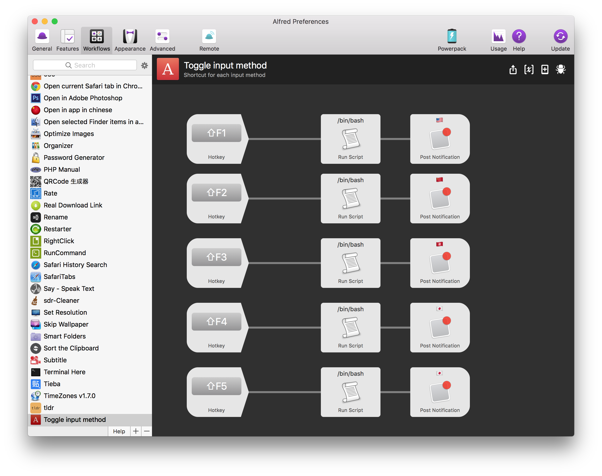

#Get Lyrics.alfredworkflow
Get lyrics with shortcut with Applescript UI

Applescript 和 python 写的快捷键获取歌词，英文和日文匹配度高，华语歌曲支持残废 = =

Special thanks to [anlar](https://github.com/anlar/prismriver-lyrics)

特别感谢 [anlar](https://github.com/anlar/prismriver-lyrics) 的这个项目和耐心帮助
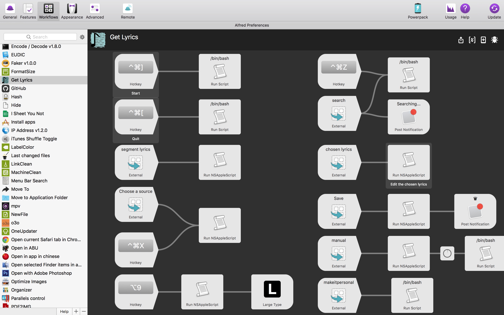
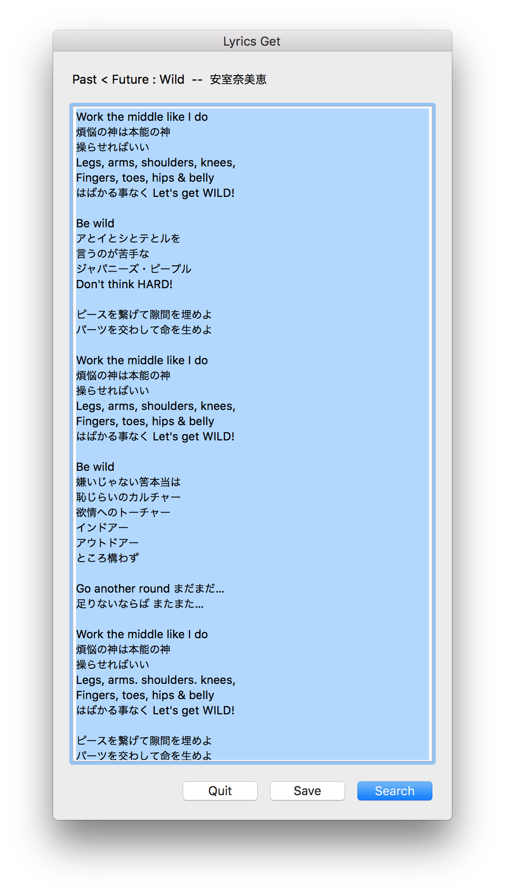
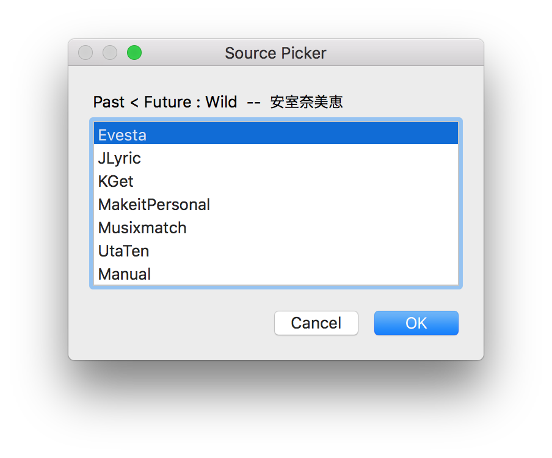
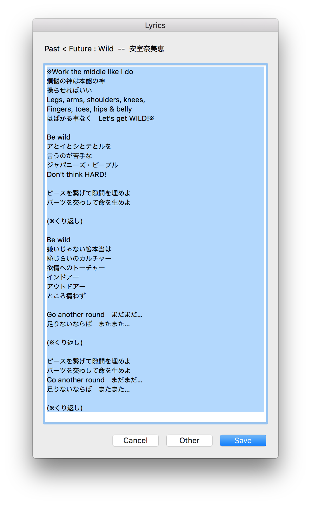

[preview movie](https://youtu.be/nJPrVlOMQko)

#prismriver-lyrics.alfredworkflow
Get lyrics with shortcut with QT5 UI

QT5 界面的歌词获取器，自动监听 iTunes 获取歌名与歌手，和上面的👆用的一样的源，不过上面的精简了一些获取库，所以速度会快一些 = =
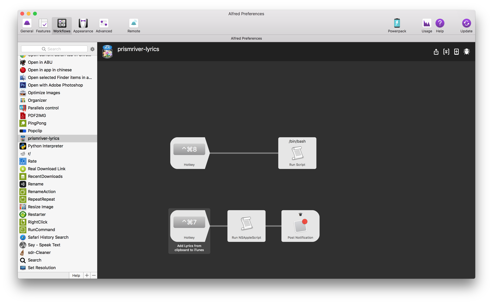
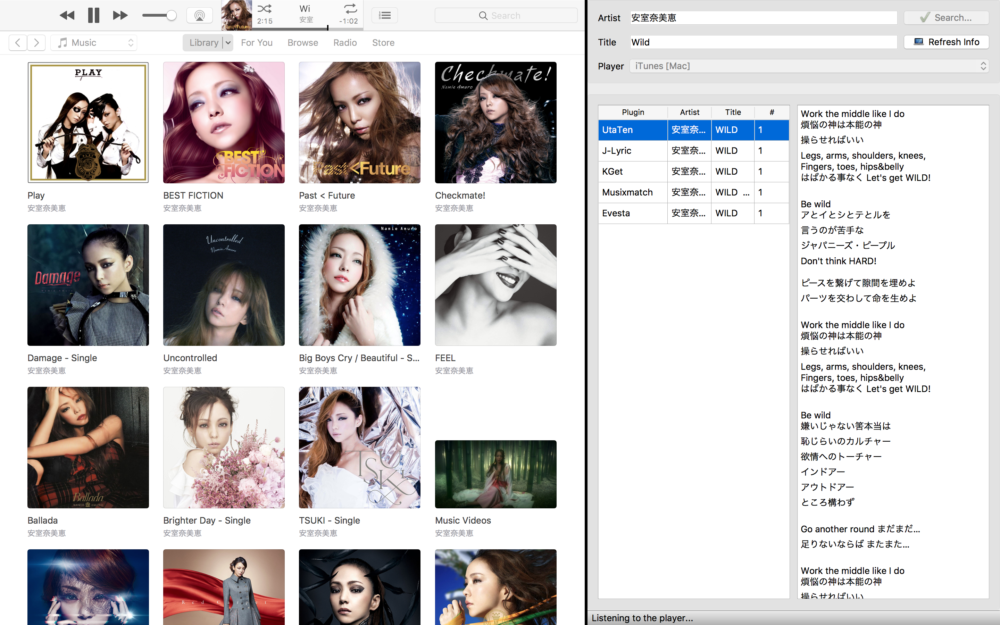

#Lyrics.alfredworkflow
Just for Archive = =

存档的残废品，不想说了，心好累 = =

#Übersicht Widgets Desktop Lyrics

Show lyrics from iTunes on desktop with [Übersicht](http://tracesof.net/uebersicht/) Widgets

modified from [Pe8er/iTunesLyrics.widget](https://github.com/Pe8er/iTunesLyrics.widget)

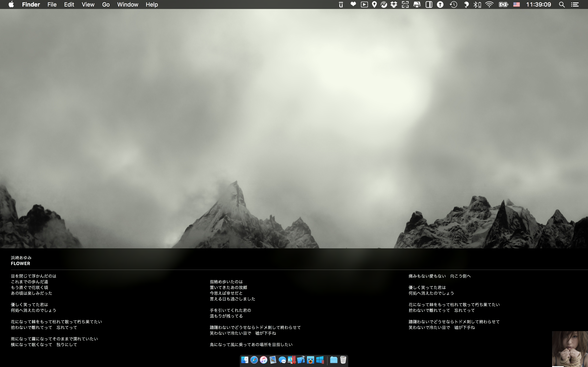

V2

V3

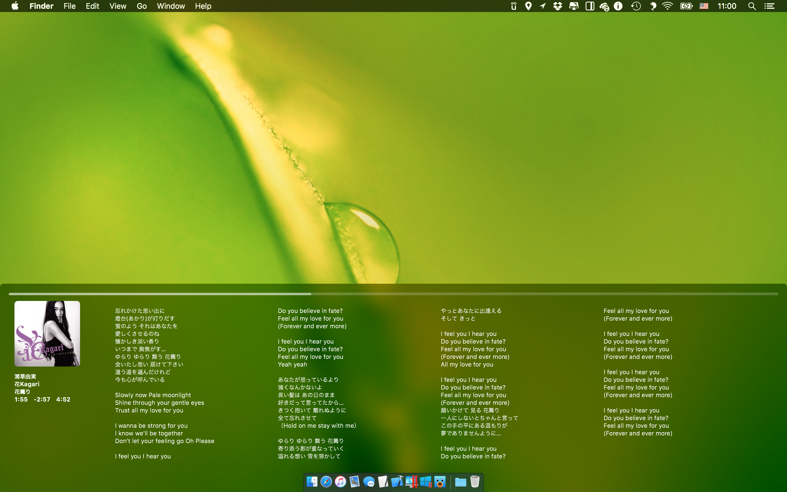

#bilibili.workflow
直接搜索并用 mpv 播放 bilibili 视频

可订阅UP主

有弹幕

#Brightness.alfredworkflow
输入数字调节屏幕亮度

1最亮 

其他数字亮度为0.x

#网易云音乐搜索.alfredworkflow

搜索网易云音乐

用 mpv 直接播放或下载

#Battery.alfredworkflow
显示电池信息

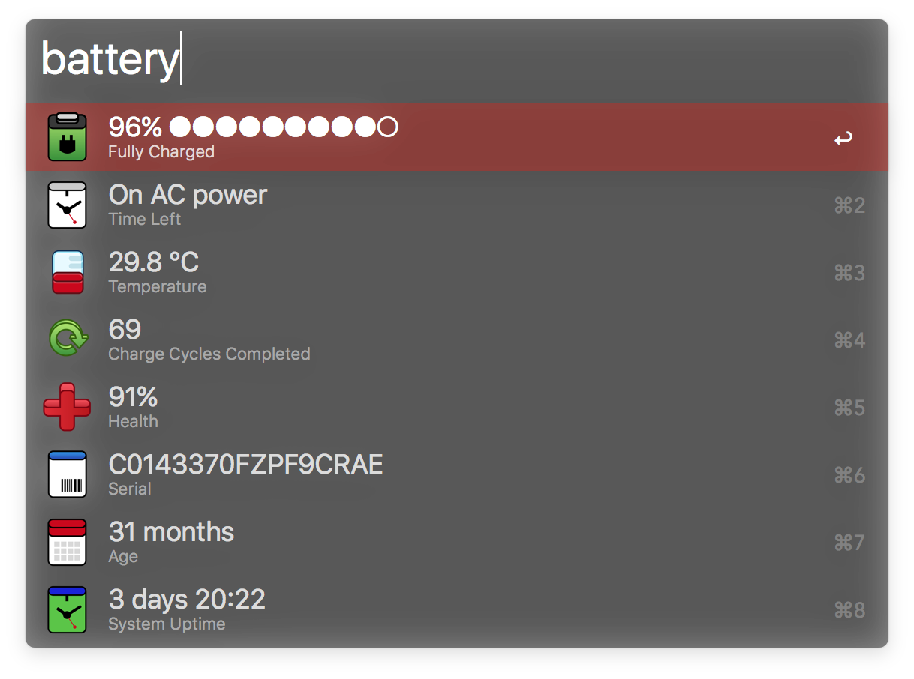

#Get Lyrics 2.0.alfredworkflow
使用 workflow script filter 显示歌词选择器

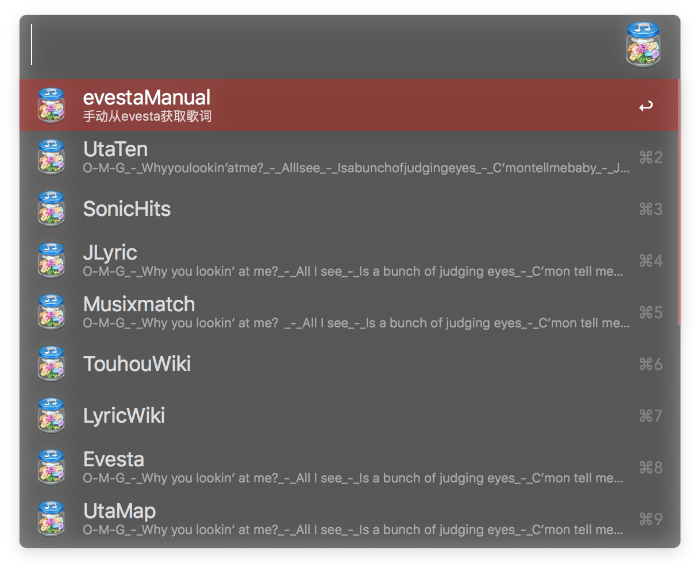

#DM5.alfredworkflow

