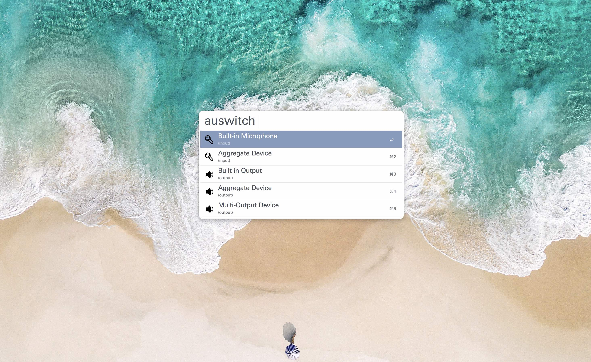

# Alfred 3 theme : Launchbar

<b>[import theme](https://www.alfredapp.com/extras/theme/slkYAfoUyf/)</b>

# Hide.alfredworkflow
Hide or Unhide Files or Folders in macOS with Alfred Workflow

将单个或多个文件或文件夹设置为显示或隐藏状态，效果相当于文件名前加. ,但不用加. = =

# Toggle input method.alfredworkflow
Set shortcut for each IM

为每个输入法自定义快捷键

# Get Lyrics.alfredworkflow
Get lyrics with shortcut with Applescript UI

Applescript 和 python 写的快捷键获取歌词，英文和日文匹配度高，华语歌曲支持残废 = =

Special thanks to [anlar](https://github.com/anlar/prismriver-lyrics)

特别感谢 [anlar](https://github.com/anlar/prismriver-lyrics) 的这个项目和耐心帮助

[preview movie](https://youtu.be/nJPrVlOMQko)

# prismriver-lyrics.alfredworkflow
Get lyrics with shortcut with QT5 UI

QT5 界面的歌词获取器，自动监听 iTunes 获取歌名与歌手，和上面的👆用的一样的源，不过上面的精简了一些获取库，所以速度会快一些 = =

# Lyrics.alfredworkflow
Just for Archive = =

存档的残废品，不想说了，心好累 = =

# Übersicht Widgets Desktop Lyrics

Show lyrics from iTunes on desktop with [Übersicht](http://tracesof.net/uebersicht/) Widgets

modified from [Pe8er/iTunesLyrics.widget](https://github.com/Pe8er/iTunesLyrics.widget)

V2

V3

# bilibili.workflow
直接搜索并用 mpv 播放 bilibili 视频

可订阅UP主

有弹幕

# Brightness.alfredworkflow
输入数字调节屏幕亮度

1最亮 

其他数字亮度为0.x

# 网易云音乐搜索.alfredworkflow

搜索网易云音乐

用 mpv 直接播放或下载

# Battery.alfredworkflow
显示电池信息

# Get Lyrics 2.0.alfredworkflow
使用 workflow script filter 显示歌词选择器

# DM5.alfredworkflow

# Music163 2.0.alfredworkflow
依然是拼拼凑凑

可以显示封面和歌词，并 scrobble 到 last.fm 了

主 workflow 来自 https://github.com/goodbest/Alfred_Workflow_Music163

播放采用 iscript 的 https://github.com/PeterDing/iScript

不过被我改得有点无法直视了 = =

歌词需要 ruby 支持，请确保自己已安装 ruby

参考 https://github.com/lin714093880/netease-lyrics-downloader

last.fm 需要安装 https://github.com/hauzer/scrobbler

需要 python3

步骤如下，无耐心者慎看 = =

git clone 到本地，然后

终端内输入 cd 进入该文件夹

python3 setup.py build

python3 setup.py install

然后把 scrobbler 文件夹内三个文件拷入 /usr/local/bin/文件夹内以防万一

然后把 scrobbler.py 的扩展名 .py 去掉，不要问我为什么 = =

然后终端里输入

scrobbler add-user

然后根据提示进行授权

然后进入安装后的这个 workflow 的文件夹里打开 wyy 文件搜索找到 minamike2007

这是我的 last.fm 账户名称 请改成你的账户名并保存 = =

有没有很晕 说实话我也有点晕 （生无可恋脸）

